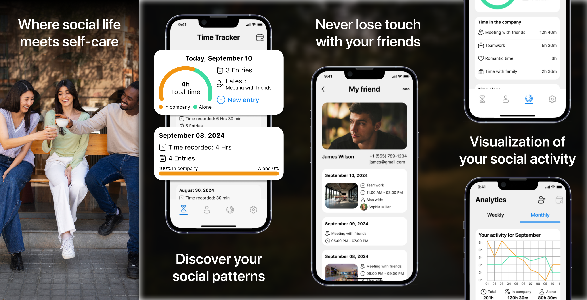
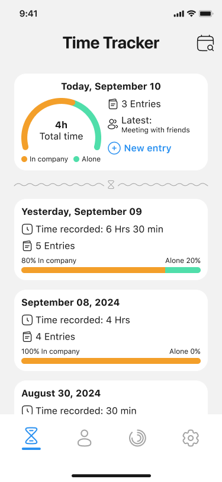
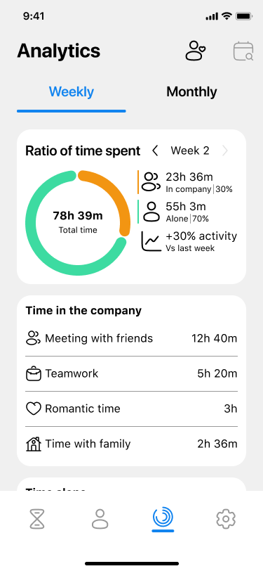
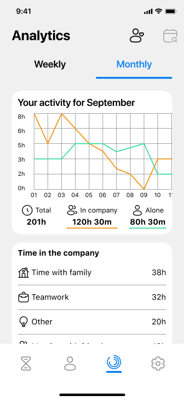

# ChronoSocial: Social Balance

**ChronoSocial** is a Flutter app that helps you monitor how your time is spent — whether in company or alone. Log activities, visualize your social balance across days, weeks, and months, and gain insights into how you connect with others.



## 🛠️ Technologies

- **Flutter** and **Dart**
- **Provider** — state management
- **Hive** — local database
- **Flutter ScreenUtil** — responsive design
- **Charts** — custom circular and line graphs
- **Local assets** — activity icons, friend avatars, UI visuals

## 📱 Screenshots

| Daily Tracker | Weekly Analytics | Monthly Analytics |
|---------------|------------------|--------------------|
|  |  |  |

## 🚀 How to Run

1. Clone the repo
   ```sh
   git clone https://github.com/NMMustafina/chrono_social_balance.git
   ```
2. Install all the packages by typing the following command
   ```sh
   flutter pub get
   ```
3. Run the App
